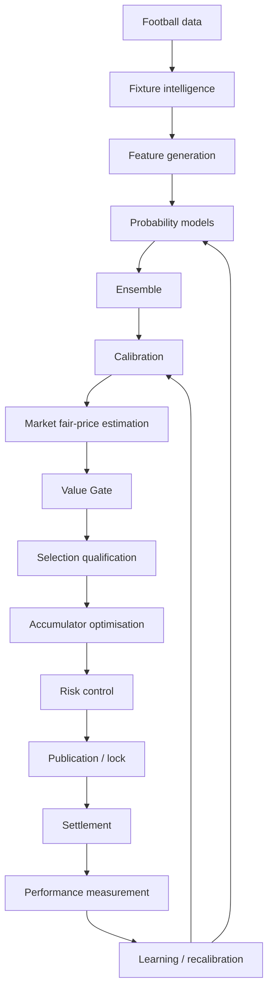

# Architecture

Canonical reference: [`QWANTEJ_FRAMEWORK.md`](QWANTEJ_FRAMEWORK.md) Parts II
and VIII (Appendix A/B). This document maps the framework's 12 logical
engines and closed decision loop onto concrete services and modules in this
repository. Where this document and the framework disagree, the framework
wins — file an issue/PR to reconcile rather than silently diverging.

## Two codebases, one system

- **`backend/`** — the web-app shell: HTTP surface, auth, request/response
  orchestration, background job wiring. It is intentionally thin.
  - `api/` — FastAPI routers (one per bounded area: fixtures, odds,
    predictions, accumulators, risk, settlement, admin/audit)
  - `core/` — config, DB session/engine, startup, logging, cross-cutting
    middleware
  - `models/` — SQLAlchemy ORM models = the tables in §12's institutional
    memory list, plus Alembic migrations
  - `schemas/` — Pydantic request/response contracts
  - `services/` — thin orchestration that calls into `qwantej`, persists via
    `models/`, and returns `schemas/` — **no quant logic lives here**
  - `workers/` — scheduled/background jobs (ingestion, scoring, settlement,
    recalibration) per §46's daily processing workflow
- **`src/qwantej/`** — the domain package: the actual forecasting engine.
  Must import and test cleanly with no FastAPI/HTTP dependency, so it can be
  backtested, unit tested and used from a worker or a notebook alike.

`backend/services` calls into `qwantej`; `qwantej` never imports from
`backend`.

## The 12 engines → modules

| # | Engine (framework §8) | Module |
|---|---|---|
| 1 | Fixture & Data Intelligence | `qwantej/fixtures/`, `qwantej/data/` (DQS) |
| 2 | Feature Engineering | `qwantej/features/` |
| 3 | Prediction Engine | `qwantej/models/{poisson,zinb,bayesian,...}` |
| 4 | Ensemble & Calibration | `qwantej/models/ensemble/`, `qwantej/calibration/` |
| 5 | Bookmaker & Market Intelligence | `qwantej/markets/` |
| 6 | Value Detection (Value Gate) | `qwantej/value/` |
| 7 | Selection Qualification (QSS) | `qwantej/value/` (qualification submodule) |
| 8 | League & Market Reliability (LRS/MRS) | `qwantej/performance/reliability.py` |
| 9 | Accumulator Optimiser | `qwantej/accumulator/` |
| 10 | Risk & Bankroll | `qwantej/bankroll/` |
| 11 | Settlement & Performance | `qwantej/performance/` |
| 12 | Continuous Learning & Model Governance | `qwantej/performance/` + `backend/workers` (scheduling) |

The API-Football boundary is split deliberately: provider payload parsing and
normalization live in `qwantej/fixtures/api_football.py`; authenticated HTTP,
canonical mapping, reconciliation, and persistence live in
`backend/services/api_football_{client,ingestion}.py`. Model-ready vectors are
then frozen through `backend/services/features.py` before an inference run can
publish a prediction.

The **governance & audit layer** surrounding all 12 engines (framework §8) is
not a separate module — it is a repo-wide obligation: every engine that
writes a decision-relevant record writes it through `backend/models` tables
that carry version/timestamp provenance (see
[`DATA_DICTIONARY.md`](DATA_DICTIONARY.md)).

## Data flow (framework §4)

## Infrastructure

Per framework §5: PostgreSQL (institutional memory), Redis (cache/locks/
jobs), Docker (reproducible runtime), Fly.io (deploy — manual, see
`DEVELOPMENT.md` §6), GitHub Actions (CI), MLflow or equivalent (model
registry/experiment tracking, once Phase 6+ needs it), Prefect (job
orchestration, once ingestion/scoring jobs exist beyond a simple scheduler).
Not all of these are provisioned yet — see the phase roadmap in
`QWANTEJ_FRAMEWORK.md` §50 for when each is introduced.

### Phase 11 operational safeguards

- API requests receive a bounded request ID, security response headers, and a
  structured completion log containing method, path, status, and elapsed time.
- Provider and notification clients retry transient network/rate-limit/server
  failures only; permanent HTTP/API rejections fail without retrying.
- Database backups are written atomically and gzip/SQL-header verified before
  retention pruning. A restore drill must still restore into a disposable
  database; backup creation alone is not restore evidence. The configured
  `pg_dump` major version must match the PostgreSQL server major version.
- Production must configure both `API_KEY` and a non-default `SECRET_KEY`.

## Build order

Follow framework §50 (Phase 0–11) — data architecture before prediction
models, prediction/calibration before value detection, value detection
before the optimiser, the optimiser before risk sizing, everything before
the dashboard. Do not build UI-visible features ahead of the decision
pipeline they depend on.
